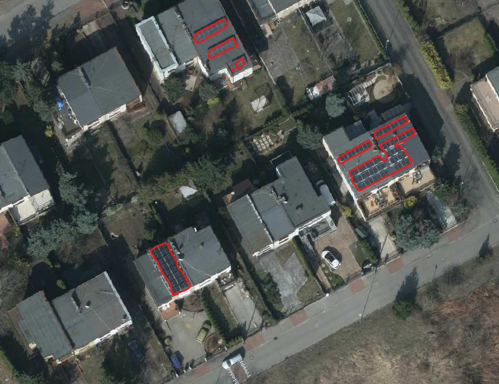
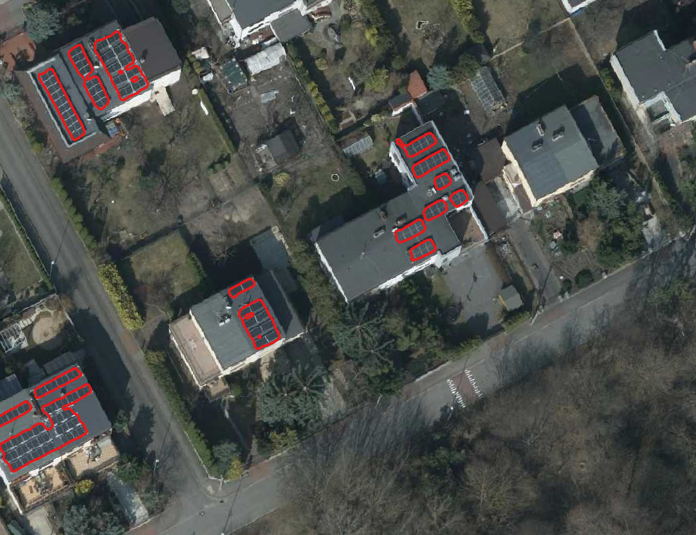
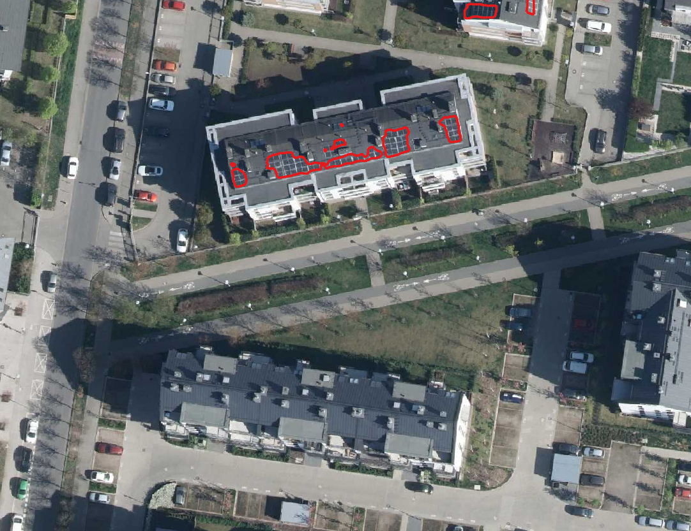
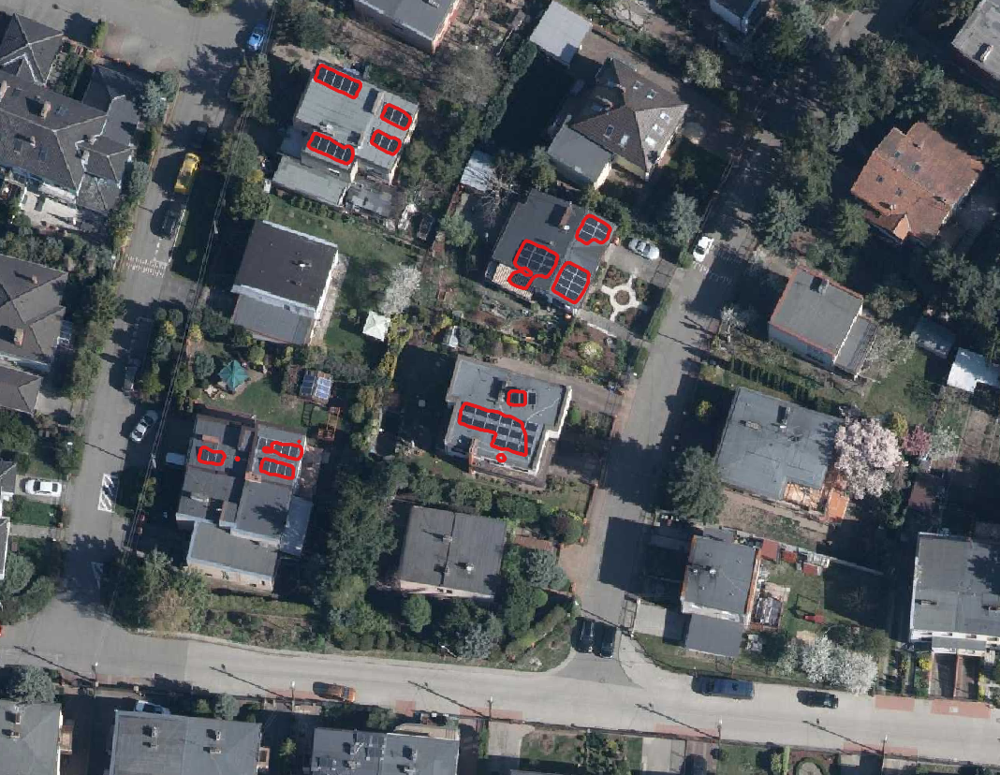
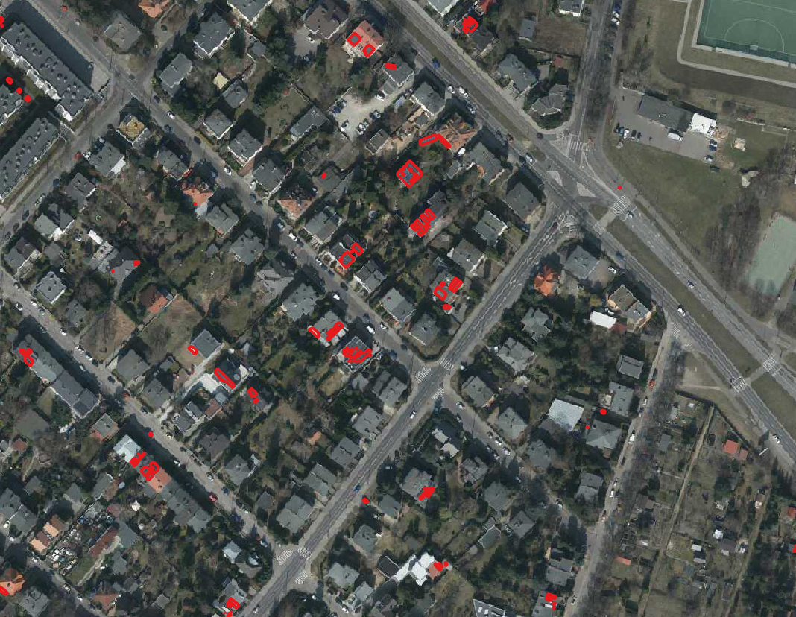
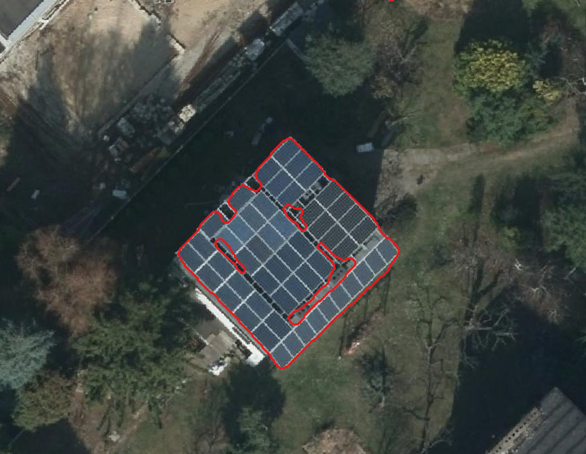
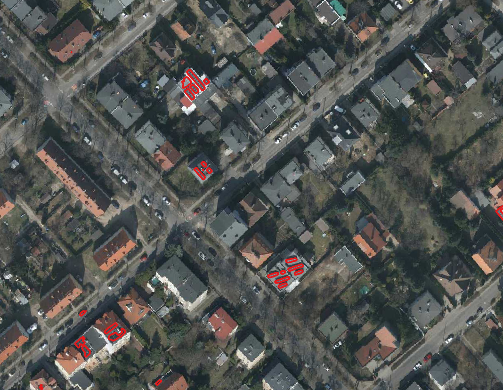
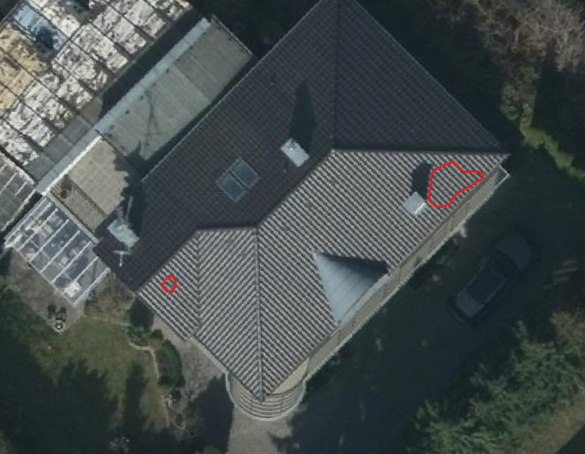
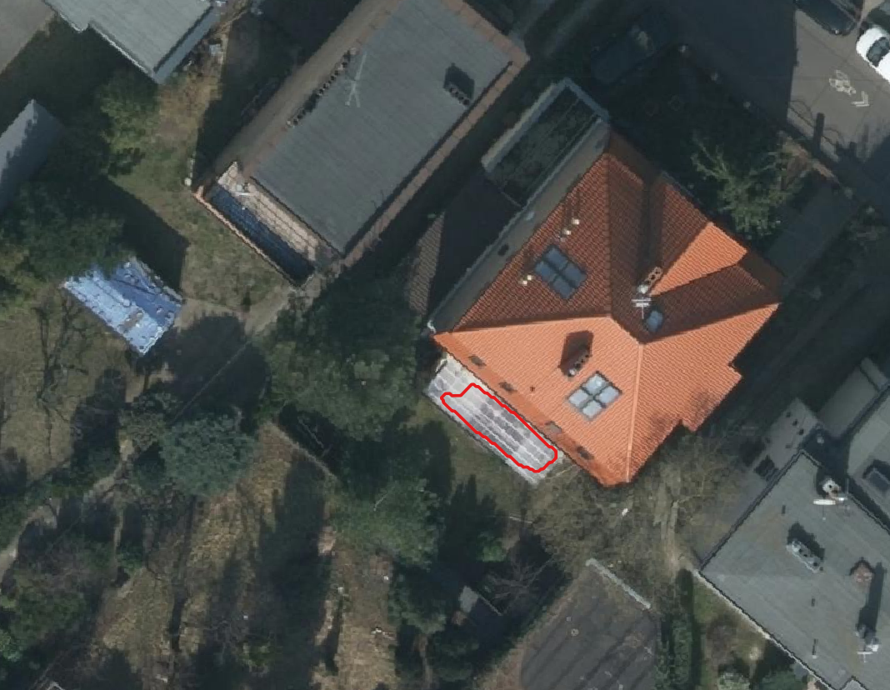

## ZPO Project - Segmentacja paneli słonecznych

Projekt koncentruje się na opracowaniu modelu głębokiego uczenia do **automatycznej segmentacji paneli słonecznych** z map o wysokiej rozdzielczośći. Model jest trenowany na niestandardowym zbiorze danych obrazów ortofotomapy Poznania z 2022 roku i odpowiadających im masek, przygotowanych za pomocą QGIS i Roboflow. Wytrenowany model jest następnie konwertowany do formatu ONNX w celu integracji z wtyczką Deepness w QGIS.

### Zbiór danych

* **Dane:** Obrazy z publicznie dostępnych baz danych oraz zebrane z ortofotomapy Poznania w QGIS obszarów mieszkalnych z widocznymi panelami słonecznymi.
* **Adnotacje:** ok. 350 obrazów z ręcznie oznaczonymi panelami słonecznymi (maski przygotowane w Roboflow).
* **Przygotowanie:**
    * Surowe obrazy zostały wstępnie przetworzone w QGIS w celu wyodrębnienia odpowiednich regionów i dostosowania rozdzielczości.
    * Panele słoneczne zostały ręcznie oznaczone za pomocą Roboflow.
    * Obrazy zostały przeskalowane do 400x400 pikseli.
    * Zbiór danych został podzielony na zbiory treningowe i testowe.
* **Przechowywanie:** [Odnośnik do zbioru danych](https://drive.google.com/drive/folders/11ptMzoiv22ziqJZgnMNuydakWCt2jOsu)
* **Format:** Obrazy w formacie PNG, maski w formacie PNG.
* **Ładowanie:** #TODO

### Trenowanie

* **Sieć:** U-Net z enkoderem ResNet34.
* **Trenowanie:** Trenowane za pomocą PyTorch z optymalizatorem Adam i funkcją straty Binary Cross-Entropy.
* **Parametry:**
    * Rozmiar partii: 350
    * Współczynnik uczenia: #TODO
    * Epoki: 100
* **Augmentacja:**
    * Losowe przycinanie
    * Losowe odbicie lustrzane w poziomie i pionie
    * Losowy obrót
    * Zmiana jasności
      
* **Skrypt:** #TODO
* **Środowisko:**
    * Python 3.21
    * Wymagania: [requirements.txt](requirements.txt
    
* **Instrukcje:** Postępuj zgodnie z instrukcjami w `[Nazwa skryptu]`, aby odtworzyć proces trenowania. #TODO

### Wyniki

* **Dobre wykrycie:**

  
* **Złe wykrycie:**
  
Model czasami napotyka trudności w rozpoznawaniu szklarni, niektórych fragmentów ciemnych dachów oraz samochodów.
Najbardziej obawialiśmy się problemów z rozróżnianiem okien dachowych, ponieważ na zdjęciach satelitarnych mogą przypominać panele fotowoltaiczne. Jednak nasz model skutecznie radzi sobie z ich odróżnianiem.

  

  
* **Metryki:**
    * Zbiór treningowy: [Metryki na zbiorze treningowym]
    * Zbiór testowy: [Metryki na zbiorze testowym]

### Wytrenowany model w ONNX

* **Model:** [Link do modelu ONNX]
* **Format:** ONNX z metadanymi Deepness (rozdzielczość przestrzenna, progi).
* **Skrypt konwersji:** `[Nazwa skryptu]`

### Demo

* **Wideo:** https://youtu.be/g4D_EFdLHG0?si=63SvEFi4WHk7xS2h
* **Ortofotomapa:** Poznan 2022 aerial ortophoto high resolution
* **Lokalizacja:** zachodnia część Poznania, na zachód rzeki Warty. Wrocław, Biskupin i okolice

### Osoby

* Antonina Frąckowiak
* Ksawery Giera
* Daniel Błaszkiewicz

### Inne informacje

* TODO DODATKOWE INFO (JEŚLI CHCEMY)
